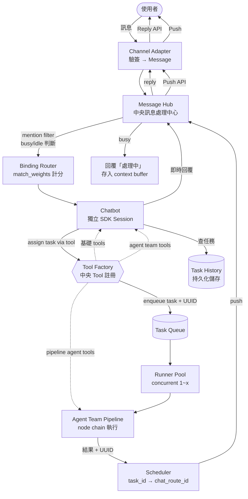
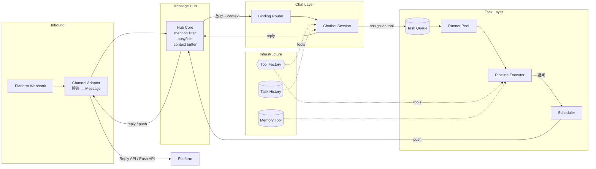

# 功能規格：Agent Gateway MVP v2

**Feature Branch**: `002-new-mvp`
**Created**: 2026-03-17
**Status**: Draft

## 一、產品定位

Chatpilot 是一個 chat-driven AI agent gateway。每個通訊軟體
頻道/群組對應一個常駐 chatbot，使用者與 chatbot 即時對話，
並可 assign 任務給已驗證的 agent team（pipeline）異步執行。

**核心互動模型**：

- **Chat（即時）**：使用者 ↔ Chatbot，快速對話，不 blocking
- **Task（異步）**：Chatbot → Scheduler → Agent Team Pipeline
  → 完成後 push 結果回原對話

Agent team（pipeline）是精心調教驗證過的任務團隊，
對 chatbot 來說就是一個 tool。使用者不直接操作 pipeline，
也看不到 pipeline 的內部結構。

---

## 二、使用者情境

### US1 (P1)：透過聊天頻道與 Chatbot 即時對話

使用者在已接入的聊天頻道（如 LINE 群組）發送文字訊息，
系統根據 binding 規則找到對應的 chatbot，chatbot 即時回應。
Chatbot 有自己的 SDK session、基礎 tools、可切換的模型。

**為何此優先級**：沒有 chatbot 即時對話，其他功能皆無法運作。

**獨立測試方式**：從 LINE 群組發送一則訊息，確認 chatbot 即時回覆。

**驗收情境**：

1. **Given** LINE 群組已設定 binding 對應一個 chatbot config，
   **When** 使用者發送「你好」，
   **Then** Chatbot 即時回覆

2. **Given** Chatbot 配有基礎 tools（如文件搜尋），
   **When** 使用者要求使用該 tool，
   **Then** Chatbot 呼叫 tool 並回覆結果

3. **Given** 使用者下指令切換模型（如 `/model claude-haiku-4.5`），
   **When** 切換完成後發送訊息，
   **Then** Chatbot 使用新模型回應

4. **Given** Chatbot 處理過程中發生錯誤，
   **When** 錯誤來自 SDK，
   **Then** 回覆友善錯誤訊息，不洩漏內部細節

---

### US2 (P1)：Assign 任務給 Agent Team 異步執行

使用者透過指令（如 `/task 查庫存`）或自然語言
（如「幫我查一下庫存」）assign 任務給 agent team。
任務進入 scheduler queue 異步執行，chatbot 立即回覆
「任務已排定」。完成後系統 push 結果回原對話。

使用者可以繼續與 chatbot 聊天，也可以同時 assign 多個任務。

**為何此優先級**：與 US1 並列 P1。Chat + Task 兩層分離是
產品核心差異化。沒有 async task，chatbot 只是普通聊天機器人。

**獨立測試方式**：Assign 一個任務，確認立即收到排定通知，
任務完成後收到 push 結果。

**驗收情境**：

1. **Given** Chatbot 配有 `inventory-report` agent team tool，
   **When** 使用者說「幫我查庫存」，
   **Then** Chatbot 識別意圖，呼叫 agent team tool，
   立即回覆「任務已排定，ID: xxx」

2. **Given** 任務 xxx 在 scheduler 中執行完成，
   **When** Agent team pipeline 產出結果，
   **Then** 系統 push 結果回原對話，帶上「你之前問了什麼」的上下文

3. **Given** 使用者 assign 任務後繼續聊天，
   **When** 使用者發送新訊息，
   **Then** Chatbot 正常回應，不被任務 blocking

4. **Given** 使用者連續 assign 3 個任務，
   **When** 3 個任務同時在 queue 中，
   **Then** Runner pool 依序或並行執行（依 config 設定），
   各自完成後分別 push 結果

5. **Given** Agent team 執行失敗（系統錯誤），
   **When** Pipeline 中的 agent session 崩潰，
   **Then** Push 錯誤通知回原對話，任務狀態標記失敗

---

### US3 (P2)：透過 CLI 直接與 Chatbot/Pipeline 互動

開發者透過 CLI 工具直接與 chatbot 對話或觸發 pipeline，
不需要啟動 webhook server。CLI 使用相同的 chatbot session
和 pipeline executor。

**為何此優先級**：開發測試路徑。

**獨立測試方式**：CLI 發送訊息，確認 chatbot 回應。
CLI 觸發 pipeline，確認結果輸出至 stdout。

**驗收情境**：

1. **Given** CLI 工具已安裝，
   **When** 使用者指定 chatbot 名稱並發送訊息，
   **Then** 輸出 chatbot 回應至 stdout

2. **Given** CLI 指定一個 agent team pipeline，
   **When** 使用者提供 task 參數，
   **Then** Pipeline 同步執行並輸出結果至 stdout

---

### US4 (P3)：Binding 路由將訊息導向正確 Chatbot

系統根據 binding 表 + 特異性分數自動匹配訊息到正確的
chatbot config。每個 chatbot 獨立 session，不共享對話記憶。
所有 channel 的 chatbot 可並行運作。

**為何此優先級**：多 chatbot 場景的路由基礎。

**獨立測試方式**：設定不同 binding 對應不同 chatbot，
驗證匹配正確。

**驗收情境**：

1. **Given** Binding 表設定群組 A → chatbot-x、群組 B → chatbot-y，
   **When** 群組 A 和群組 B 同時發送訊息，
   **Then** 各自由對應 chatbot 處理，並行不互相阻塞

2. **Given** 群組 C 未在 binding 表中且無 default，
   **When** 群組 C 發送訊息，
   **Then** 系統完全不回應

3. **Given** Binding 表同時有 platform-level 和 group-level 規則，
   **When** 該 group 發送訊息，
   **Then** 系統選擇 score 較高的 binding

4. **Given** 使用者在群組 A 下指令切換 chatbot，
   **When** 切換完成後發送訊息，
   **Then** 由新 chatbot 處理，且變更永久生效

---

### US5 (P3)：查看任務歷史

使用者可在對話中查詢任務執行歷史，包含任務 ID、狀態、
建立時間、耗時、input 參數摘要、output 結果摘要。
任務歷史是 chatbot 的一個 tool。

**為何此優先級**：任務是異步的，使用者需要追蹤方式。

**獨立測試方式**：Assign 數個任務後，查詢歷史確認完整。

**驗收情境**：

1. **Given** 已有 3 個已完成任務和 1 個進行中任務，
   **When** 使用者說「查任務」或 `/tasks`，
   **Then** Chatbot 列出任務清單，包含狀態、時間、摘要

2. **Given** 使用者查詢特定任務 ID，
   **When** 說「任務 xxx 的結果」，
   **Then** Chatbot 回覆該任務的完整結果

---

### US6 (P4)：新增頻道 Adapter 不影響核心

新增一個聊天頻道時，只需實作 adapter，不需修改
chatbot、scheduler、pipeline 或 routing 程式碼。

**為何此優先級**：架構驗證。

**驗收情境**：

1. **Given** 系統已有 LINE adapter，
   **When** 新增 mock adapter，
   **Then** 核心程式碼零修改

---

### 邊界情況

- 頻道 webhook 簽章驗證失敗時，拒絕請求
- SDK / 模型服務不可用時，回覆友善錯誤訊息
- 訊息包含特殊字元、超長文字、空白時，不導致崩潰
- 同一群組短時間內大量訊息時，chatbot 逐筆處理不丟失
- Binding 表為空時，所有訊息靜默忽略
- Chatbot 回應超出頻道長度限制時，截斷或分段
- 私聊時，以 platform-level binding 或 default 處理
- Queue 滿時，新任務回覆「系統忙碌，請稍後再試」
- Agent team pipeline 某個 node 失敗時，push 錯誤通知
- Push 送回原對話失敗（binding 壞掉）時，send & forget
- 含迴圈的 node 必須有有限跳出條件
- 任務歷史查無結果時，回覆「目前沒有任務記錄」

---

## 三、Functional Requirements

### Chatbot

- **FR-001**: 系統 MUST 定義統一 `Message` 格式（文字、使用者 ID、
  平台標識、對話 ID、平台 context）
- **FR-002**: 系統 MUST 定義統一 `Response` 格式（文字、附件，
  MVP 僅文字）
- **FR-003**: 每個 chatbot MUST 為獨立的 SDK session，
  帶自己的 model、system_message、tools（統一清單，
  Tool Factory 區分類型）
- **FR-004**: Chatbot MUST 支援模型切換指令，切換後永久生效
- **FR-005**: Chatbot MUST 同時支援明確指令（如 `/task`）和
  自然語言（AI 判斷）兩種方式觸發 agent team

### Channel Adapter

- **FR-006**: 系統 MUST 提供頻道 adapter 介面（Inbound: webhook
  → Message；Outbound: Response → 平台格式）
- **FR-007**: 系統 MUST 實作 LINE adapter（webhook + 簽章驗證
  + Reply API + Push API）
- **FR-008**: Adapter MUST 支援 Push API 用於異步任務結果回報

### Message Hub

- **FR-008a**: 系統 MUST 實作 Message Hub（中央訊息處理中心），
  所有訊息進出（inbound + reply + push）MUST 經過 Message Hub
- **FR-008b**: Message Hub MUST 管理 per-chatbot 的 busy/idle 狀態。
  Chatbot busy 時新訊息回覆「處理中」，不放行、不排隊
- **FR-008c**: 群組場景 MUST 只回應 @bot mention 的訊息，
  其餘訊息不回應但存入 context buffer。私聊場景處理所有訊息
- **FR-008d**: Message Hub 介面 MUST 與實作分離，MVP 用 in-memory，
  未來可換 message broker
- **FR-008e**: Chatbot busy 期間收到的 @bot 訊息 MUST 記錄 log
  且存入 context buffer（不處理但保留內容，下次回應時帶入上下文）
- **FR-008f**: 群組場景非 @bot 的訊息 MUST 存入 per-chatbot
  context buffer（sliding window，大小由 `context_window` 設定）。
  下次 @bot 觸發時，buffer 內容作為上下文一起送進 chatbot。
  注入時 MUST 區分「背景對話」與「直接對 bot 說的訊息」兩種
  權重，使用結構化格式讓 chatbot 能判斷優先級
- **FR-008g**: Context buffer MUST 每 `context_window` 則為單位
  flush 到 disk 持久化。In-memory 為 hot layer（即時存取），
  disk 為 cold layer（歷史查詢、重啟恢復、未來 RAG 來源）

### Binding & Routing

- **FR-009**: 系統 MUST 實作 binding-based routing，以
  match_weights 分數表計算特異性，最高分 binding 勝出。
  Binding 對應 chatbot config（不是 pipeline）
- **FR-010**: 使用者切換 binding 時 MUST 覆蓋（不 append），
  永久生效
- **FR-011**: 分數表 MUST 可擴展新維度而不需改 code。
  MVP 維度：group_id（10）、user_id（8）、platform（5）
- **FR-012**: 所有 channel 的 chatbot MUST 可並行運作，
  各自獨立 session 不共享對話記憶

### Scheduler & Task

- **FR-013**: 系統 MUST 實作 task scheduler，包含一個 queue
  和可設定的 runner pool（concurrent_runners 由 config 決定）
- **FR-014**: 所有 chatbot 共用一個 queue，runner 從 queue
  取任務執行
- **FR-015**: 每個 task MUST 有 UUID，用於整條鏈路的
  傳遞綁定（chatbot → queue → runner → push）
- **FR-016**: Task 生命週期：建立 → 排隊 → 執行中 → 完成/失敗
- **FR-017**: Chatbot 呼叫 agent team tool 時，MUST 立即回覆
  「任務已排定，ID: xxx」，不等待執行結果
- **FR-018**: 系統 MUST 記錄 task_id ↔ chat_route_id 對應關係，
  用於結果路由
- **FR-019**: Task 完成後 MUST push 結果回原對話，
  帶上原始問題的上下文
- **FR-020**: Task 結果 MUST 經由 Message Hub 送出（push），
  由 Message Hub 決定送達策略。MVP 預設 binding 壞掉時不重試
- **FR-021**: Scheduler 介面 MUST 與實作分離，MVP 底層
  用 in-memory queue，介面設計好未來可換 Redis / RabbitMQ
- **FR-021a**: Message Hub 與 Task Scheduler 兩個中心的
  queue 核心 MUST 保留介面抽換能力，不耦合特定實作

### Tool Factory

- **FR-022**: 所有 tool MUST 由中央 Tool Factory 統一註冊產出，
  不得在 agent 內部自行實作。Tool 在 SDK program 端執行，
  Copilot CLI 只是呼叫點
- **FR-022a**: Tool Factory MUST 支援 tool 分級存取控制：
  (1) **全域 tool**：任何 context 皆可使用
  (2) **chatbot-only tool**：僅 chatbot session 可使用
  （含 agent team tool，即 async task 調用）
  (3) **agent-team-only tool**：僅 pipeline 內部 agent 可使用
- **FR-022b**: 每個 tool MUST 可獨立測試，不依賴特定 agent
  或 pipeline context
- **FR-022c**: **硬約束**：Agent team 內部的 agent MUST NOT
  呼叫 agent team tool（禁止遞迴調用），違反此約束時
  系統 MUST 拒絕執行並記錄 error
- **FR-022d**: Tool MUST 為 stateless function，不管理自身
  併發。涉及寫入的 IO 操作 MUST 由 IO 層提供 atomic 操作
  或 async 排隊處理，tool 層不負責併發控制

### Agent Team (Pipeline)

- **FR-023**: Agent team 是精心調教驗證過的 pipeline，
  對 chatbot 來說是一個 tool
- **FR-024**: Pipeline 內部的 node 組合依功能需求自行設計，
  不限定固定 node type
- **FR-025**: Pipeline 內使用 SDK session 的 node MUST 建立
  獨立 session，使用的 tools MUST 從 Tool Factory 取得
- **FR-026**: 含迴圈的 node MUST 設定有限跳出條件，
  不允許無限迴圈
- **FR-027**: Node 間資料傳遞 MUST 為 JSON object
- **FR-028**: 系統 MUST 提供 Memory Tool（外部記憶），
  供跨 node 脈絡保留、存取控制、清單化執行追蹤

### Task History

- **FR-029**: 任務資料 MUST 持久化儲存（重啟不丟失），包含：
  task_id、建立時間、狀態、input 參數、output 結果、
  耗時、對應的 chat_route_id
- **FR-030**: 任務歷史查詢 MUST 作為 chatbot 的一個 tool，
  支援列出清單和查詢特定任務結果

### 其他

- **FR-031**: 系統 MUST 提供 CLI 工具（直接對話 + 觸發 pipeline）
- **FR-032**: Config MUST 支援熱重載
- **FR-033**: 機敏設定 MUST 透過環境變數管理
- **FR-034**: 未匹配 binding 的訊息 MUST 不回應使用者，
  但 MUST 記錄 error log（adapter 已接入但 config 對應不到
  屬配置問題，需被發現）
- **FR-035**: 錯誤時 MUST 回傳友善訊息
- **FR-036**: 系統 MUST 完整 logging（訊息、binding 結果、
  task 狀態、pipeline 過程、push 結果）

---

## 四、架構設計

### 4.1 核心互動模型



### 4.2 兩層分離 + 兩個中心

| 層 | 職責 | 特性 |
|----|------|------|
| **Chat 層** | 使用者 ↔ Chatbot 即時對話 | 同步、快速、不 blocking |
| **Task 層** | Agent Team Pipeline 異步執行 | 異步、可並行、push 回報 |

| 中心 | 管什麼 | 方向 |
|------|--------|------|
| **Message Hub** | 即時訊息進出 | Channel ↔ Chatbot（雙向） |
| **Task Scheduler** | 異步任務排程 | Chatbot → Agent Team → Push（單向） |

Chat 層永遠不會被 Task 層 blocking。
Task 結果 push 時也經由 Message Hub 出去。

### 4.3 Binding-Based Routing

Binding 將 match 條件對應到 chatbot 類型名稱。
系統內部依據 binding match + chatbot 類型自動建立獨立 session
（UUID 由系統產生，config 不處理）。
每個 session 不共享對話記憶，所有 channel 並行運作。

```yaml
match_weights:
  group_id: 10
  user_id: 8
  platform: 5

bindings:
  - match: { platform: "line", group_id: "C456" }
    chatbot: warehouse-bot        # score = 15
  - match: { platform: "line" }
    chatbot: general-bot          # score = 5
  - chatbot: general-bot          # score = 0 (default)
```

### 4.4 Message Hub（中央訊息處理中心）

所有訊息進出 MUST 經過 Message Hub，統一管理收與送。

**職責**：

- **Inbound**：從 adapter 接收 Message，判斷 chatbot 狀態，
  決定放行或攔截
- **Outbound**：chatbot reply 和 task push 都經過這裡，
  統一轉給 adapter 發出
- **狀態管理**：per-chatbot 的 busy/idle
- **Mention filter**：群組場景只處理 @bot 的訊息，
  私聊場景所有訊息都處理
- **Logging**：所有進出的統一切面

**Inbound 策略（一來一回 + context buffer）**：

```
收到訊息
  → 群組？→ 是否 @bot？→ 否 → 存入 context buffer（不回應）
                        → 是 → chatbot idle？→ 從 context buffer 取出近期對話
                                               合併為 context，一起送進 chatbot
                                             → busy → 回覆「處理中」，存入 context buffer（不處理但保留內容）
  → 私聊？→ chatbot idle？→ 放行
                          → busy → 回覆「處理中」，存入 context buffer
```

一來一回：chatbot 處理中不接受新訊息，不排隊。
被丟棄的訊息 MUST 記錄 log。

**Context Buffer（群組上下文記憶）**：

- Per-chatbot 的 sliding window，存最近 N 則群組訊息
  （N 由 chatbot config 的 `context_window` 設定）
- 非 @bot 的訊息不觸發回應，但存入 buffer
- 下次 @bot 觸發時，buffer 內容作為對話上下文
  一起送進 chatbot（context prefix）
- 每 N 則為單位 flush 到 disk 持久化，保留完整群組對話歷史
- In-memory buffer 是 hot layer（即時存取），
  disk 是 cold layer（歷史查詢、重啟恢復、未來 RAG 來源）

**介面與實作分離**：

- 介面：receive、send、push、get_status、buffer_context、flush_context
- MVP 實作：in-memory（狀態管理 + context buffer + 直接轉發）
- 未來：可換為有持久化能力的 message broker

### 4.5 Task Scheduler & Runner Pool

```
n(chatbot) ──→ [1 Queue] ──→ m(Runner Pool)
```

- 所有 chatbot 共用一個 queue
- Runner pool 大小由 config 設定（`concurrent_runners`）
- 設定 1 = 所有任務排隊；設定 2+ = 並行執行
- 每個 task 有 UUID，貫穿整條鏈路
- Scheduler 記錄 task_id ↔ chat_route_id 對應

**Task 生命週期**：

```
建立 → 排隊(queued) → 執行中(running) → 完成(completed) / 失敗(failed)
                                              │
                                              └→ push 結果回原對話
```

**Scheduler 介面與實作分離**：
- 介面：enqueue、dequeue、get_status、get_history
- MVP 實作：in-memory queue
- 未來：可換 Redis / RabbitMQ

### 4.6 Agent Team (Pipeline)

Agent team = 精心調教驗證過的 pipeline。
統一註冊在 Tool Factory，chatbot 作為 tool 呼叫。
呼叫時由 Tool Factory 送入 Scheduler 異步執行，
chatbot 看到的就是一個普通 tool，pipeline 內部結構透明。

**Config 彈性限制**：
- 只保留名稱 + 部分參數化資料
- 不允許使用者任意組合 pipeline 結構
- 每個 agent team 都是經過驗證才接上的

**Pipeline 開發框架**：

Pipeline 內部的 node 組合不限定固定類型，依任務需求自由設計。
框架需提供良好的開發接口：

- 標準化的 input/output 格式與註冊機制
- 集中的 node 註冊區域
- Sample / template 供後續實作者參照
- 每個 node 可獨立測試

### 4.7 完整資料流



### 4.8 SDK Integration

- Chatbot 和 pipeline 內的 agent 都有獨立 SDK session
- Agent 擁有 session config（tools、model、system_message）
- SDK 功能透明暴露，不包黑盒
- custom_agents 無法存取 session-level external tools（已驗證，
  見 `spike/test_subagent_tools.py`）
- 跨 session 共享：Node 結果傳遞（主要）+ Memory Tool（輔助）

### 4.9 錯誤處理

**Chat 層**：
- SDK 錯誤 → 回覆友善訊息

**Task 層**：
- 任務層錯誤（agent 未完成）→ pipeline 內部依設計處理
- 系統層錯誤（session crash）→ push 錯誤通知回原對話，
  任務狀態標記 failed
- Push 失敗（binding 壞掉）→ 由 Message Hub 決定策略，
  MVP 不重試

---

## 五、Config 完整結構

Config 只管**宣告**（模型能力、工具能力），不管**流程**。
Pipeline 內部流程由 code 決定，Tool 註冊由 Tool Factory 管理。

```yaml
# Binding routing
match_weights:
  group_id: 10
  user_id: 8
  platform: 5

bindings:
  - match: { platform: "line", group_id: "C456" }
    chatbot: warehouse-bot
  - match: { platform: "line" }
    chatbot: general-bot
  - chatbot: general-bot

# Chatbot 定義（模型 + 可用 tools）
chatbots:
  general-bot:
    model: gpt-4.1
    system_message: "你是通用助手..."
    tools:                        # 統一清單，Tool Factory 自己區分類型
      - search_documents          # 基礎 tool
      - inventory-report          # agent team tool（async）
      - weekly-summary            # agent team tool（async）
    task_history: true
    context_window: 20

  warehouse-bot:
    model: gpt-4.1
    system_message: "你是倉庫管理助手..."
    tools:
      - lookup_inventory
      - inventory-report
      - stock-alert
    task_history: true
    context_window: 30

# Pipeline 內部 agent 定義（模型 + 可用 tools）
agents:
  warehouse-agent:
    model: claude-haiku-4.5
    workdir: ~/warehouse
    tools: [lookup_inventory]

  data-collector:
    model: gpt-4.1
    tools: []

  analyzer:
    model: gpt-4.1
    tools: []

  reporter:
    model: gpt-4.1
    tools: []

# Scheduler
scheduler:
  concurrent_runners: 2
```

**Config 不包含的**（由 code / Tool Factory 管理）：
- Pipeline 的 node 組合與流程邏輯
- Tool 的 description、params schema、存取級別
- Agent team 的內部結構

---

## 六、假設條件

- 每個 Chatpilot instance 對應一個 LINE Official Account
- LINE Official Account 與 Messaging API channel 已建立
- 使用者已有 GitHub Copilot 訂閱（免費方案即可）
- cloudflared tunnel 已設定
- GPT-4.1 免費額度足夠
- MVP 不處理非文字輸入
- 本服務為本地自架，訊息無隱私疑慮
- LINE Push API 費用可接受（限小群組 / 1:1 私聊使用）

## 七、範圍外（MVP 不包含）

- 非 LINE 頻道的 adapter（架構支援擴展）
- 非文字訊息處理
- 跨 session 長期記憶
- 使用者身份驗證 / 權限管理
- 管理後台 / 監控儀表板
- Push 指定轉送到其他對話（另一個 feature）
- Persistent queue（Redis / RabbitMQ，MVP 用 in-memory）

## 八、Success Criteria

- **SC-001**: 使用者從 LINE 發送訊息後 3 秒內收到 chatbot 回應
- **SC-002**: Assign 任務後 1 秒內收到「任務已排定」確認
- **SC-003**: 任務完成後 5 秒內 push 結果回原對話
- **SC-004**: Chatbot 對話不被任何進行中的 task blocking
- **SC-005**: 未匹配 binding 的訊息靜默率 100%
- **SC-006**: 新增 mock adapter 時核心程式碼修改量零行
- **SC-007**: 錯誤時 100% 回傳友善提示
- **SC-008**: 任務歷史可查詢所有已完成和進行中的任務
- **SC-009**: Runner pool 設定 2 時，2 個任務可同時執行

## 九、待決事項

- [ ] 系統層錯誤處理策略：survey SDK timeout/error 行為
- [ ] Node output 的系統層必填欄位具體定義
- [ ] completion_condition 的表達格式
- [ ] Memory Tool 的儲存後端
- [ ] Script node 的 I/O 規範
- [ ] Task history 的持久化方式（file? SQLite?）
- [ ] Task UUID 的生成策略
- [ ] Queue 滿載時的 backpressure 策略
